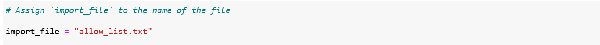
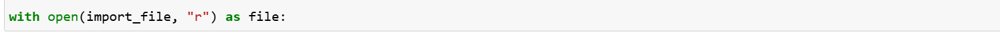
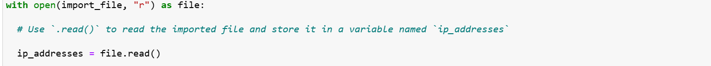
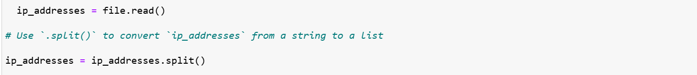
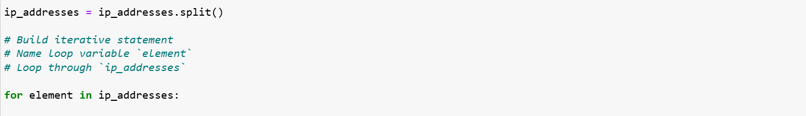
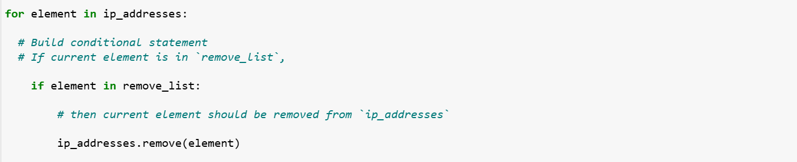
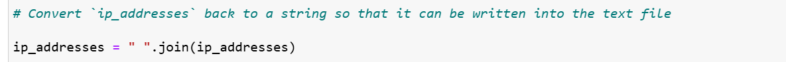
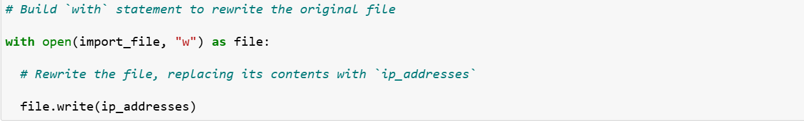

# Update a file through a Python algorithm

## Project description

At my organization, access to restricted content is controlled with an allow list of IP addresses. The "allow\_list.txt" file identifies these IP addresses. A separate remove list identifies IP addresses that should no longer have access to this content. I created an algorithm to automate updating the "allow\_list.txt" file and remove these IP addresses that should no longer have access. 

## Open the file that contains the allow list

## For the first part of the algorithm, I opened the "allow\_list.txt" file. First, I assigned this file name as a string to the import\_file variable:

Then, I used a with statement to open the file:

 

In my algorithm, the with statement is used with the .open() function in read mode to open the allow list file for the purpose of reading it. The purpose of opening the file is to allow me to access the IP addresses stored in the allow list file. The with keyword will help manage the resources by closing the file after exiting the with statement. In the code with open(import\_file, "r") as file:, the open() function has two parameters. The first identifies the file to import, and then the second indicates what I want to do with the file. In this case, "r" indicates that I want to read it. The code also uses the as keyword to assign a variable named file; file stores the output of the .open() function while I work within the with statement.

## Read the file contents

In order to read the file contents, I used the .read() method to convert it into the string.

When using an .open() function that includes the argument "r" for “read,” I can call the .read() function in the body of the with statement. The .read() method converts the file into a string and allows me to read it. I applied the .read() method to the file variable identified in the with statement. Then, I assigned the string output of this method to the variable ip\_addresses. 

In summary, this code reads the contents of the "allow\_list.txt" file into a string format that allows me to later use the string to organize and extract data in my Python program.

## Convert the string into a list

In order to remove individual IP addresses from the allow list, I needed it to be in list format. Therefore, I next used the .split() method to convert the ip\_addresses string into a list:

The .split() function is called by appending it to a string variable. It works by converting the contents of a string to a list. The purpose of splitting ip\_addresses into a list is to make it easier to remove IP addresses from the allow list. By default, the .split() function splits the text by whitespace into list elements. In this algorithm, the .split() function takes the data stored in the variable ip\_addresses, which is a string of IP addresses that are each separated by a whitespace, and it converts this string into a list of IP addresses. To store this list, I reassigned it back to the variable ip\_addresses. 

## Iterate through the remove list

A key part of my algorithm involves iterating through the IP addresses that are elements in the remove\_list. To do this, I incorporated a for loop:

The for loop in Python repeats code for a specified sequence. The overall purpose of the for loop in a Python algorithm like this is to apply specific code statements to all elements in a sequence. The for keyword starts the for loop. It is followed by the loop variable element and the keyword in. The keyword in indicates to iterate through the sequence ip\_addresses and assign each value to the loop variable element. 

## Remove IP addresses that are on the remove list

My algorithm requires removing any IP address from the allow list, ip\_addresses, that is also contained in remove\_list.  Because there were not any duplicates in ip\_addresses, I was able to use the following code to do this:

First, within my for loop, I created a conditional that evaluated whether or not the loop variable element was found in the ip\_addresses list. I did this because applying .remove() to elements that were not found in ip\_addresses would result in an error. 

Then, within that conditional, I applied .remove() to ip\_addresses. I passed in the loop variable element as the argument so that each IP address that was in the remove\_list would be removed from ip\_addresses.

## Update the file with the revised list of IP addresses 

As a final step in my algorithm, I needed to update the allow list file with the revised list of IP addresses. To do so, I first needed to convert the list back into a string. I used the .join() method for this:

The .join() method combines all items in an iterable into a string. The .join() method is applied to a string containing characters that will separate the elements in the iterable once joined into a string. In this algorithm, I used the .join() method to create a string from the list ip\_addresses so that I could pass it in as an argument to the .write() method when writing to the file "allow\_list.txt". I used the string ("\\n") as the separator to instruct Python to place each element on a new line. 

Then, I used another with statement and the .write() method to update the file:

This time, I used a second argument of "w" with the open() function in my with statement. This argument indicates that I want to open a file to write over its contents. When using this argument "w", I can call the .write() function in the body of the with statement. The .write() function writes string data to a specified file and replaces any existing file content. 

In this case I wanted to write the updated allow list as a string to the file "allow\_list.txt". This way, the restricted content will no longer be accessible to any IP addresses that were removed from the allow list. To rewrite the file, I appended the .write() function to the file object file that I identified in the with statement. I passed in the ip\_addresses variable as the argument to specify that the contents of the file specified in the with statement should be replaced with the data in this variable.

## Summary

I created an algorithm that removes IP addresses identified in a remove\_list variable from the "allow\_list.txt" file of approved IP addresses. This algorithm involved opening the file, converting it to a string to be read, and then converting this string to a list stored in the variable ip\_addresses. I then iterated through the IP addresses in remove\_list. With each iteration, I evaluated if the element was part of the ip\_addresses list. If it was, I applied the .remove() method to it to remove the element from ip\_addresses.. After this, I used the .join() method to convert the ip\_addresses back into a string so that I could write over the contents of the "allow\_list.txt" file with the revised list of IP addresses.  
